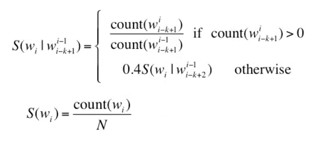

<style type="text/css">

h1.title {
  font-size: 38px;
  color: DarkBlue;
  text-align: center;
}
h4.author { /* Header 4 - and the author and data headers use this too  */
    font-size: 20px;
  font-family: "Times New Roman", Times, serif;
  color: Black;
  text-align: center;
}
h4.date { /* Header 4 - and the author and data headers use this too  */
  font-size: 18px;
  font-family: "Times New Roman", Times, serif;
  color: DarkRed;
  text-align: center;
}
</style>

```{r setup, include=FALSE}
knitr::opts_chunk$set(echo = TRUE, message = FALSE, warning = FALSE)
```

# Introduction

This document is the milestone report required by the Data Science Specialization [Capstone Project](https://www.coursera.org/learn/data-science-project) designed by Johns Hopkins University Bloomberg School of Public Health and its industry partner [SwiftKey](https://www.microsoft.com/en-us/swiftkey/about-us) on Coursera.

This Capstone Project aims to develop an English-language application that is able to predict the next word based on previous words a user has typed in. We will establish a N-grams probablistic language model using three collections of English documents (corpora): *en_US.blogs*, *en_US.news* and *en_US.twitter*. The application to be built will return **top 5 ranked** next words.     


# Exploring the Text Data 

### 1. Download the Data Set

We download all three corpora from the [course website](https://d396qusza40orc.cloudfront.net/dsscapstone/dataset/Coursera-SwiftKey.zip) and have a quick overview on their dimensions. 

```{r }
blogs <- readLines(file("en_US.blogs.txt","rb"), encoding = "UTF-8", skipNul = TRUE)
news <- readLines(file("en_US.news.txt","rb"), encoding = "UTF-8", skipNul = TRUE)
twitter <- readLines(file("en_US.twitter.txt","rb"), encoding = "UTF-8", skipNul = TRUE)
```

```{r results = "asis"}
sumTable<- data.frame(
      CorpusName = c("en_US.blogs", "en_US.news", "en_US.twitter"),
      TextCount = c(length(blogs),length(news),length(twitter)),
      MinLength = c(min(nchar(blogs)), min(nchar(news)), min(nchar(twitter))),
      MaxLength = c(max(nchar(blogs)), max(nchar(news)), max(nchar(twitter))),
      MeanLength = c(mean(nchar(blogs)), mean(nchar(news)), mean(nchar(twitter))),
      TotalWords = c(sum(nchar(blogs)), sum(nchar(news)), sum(nchar(twitter))) 
      )
library(knitr)
kable(sumTable, caption = "Summary of all three corpora")
rm(sumTable)
```

To prepare for the exploratory work, we will randomly sample about 1% texts from each corpus and combine them into a new data set. We can come back to this step if larger sampling is allowed for our computer. 

```{r }
set.seed(123)
index <- list(b = rbinom(n = length(blogs), size = 1, prob = 0.01),
           n = rbinom(n = length(news), size = 1, prob = 0.01),
           t = rbinom(n = length(twitter), size = 1, prob = 0.01))
saveRDS(index, file = "./index.RDS")

bnt <- c(blogs[as.logical(index$b)], news[as.logical(index$n)], twitter[as.logical(index$t)])
rm(blogs); rm(news); rm(twitter); rm(index)
```


### 2. Remove Profanity

we need to remove any text containing the dirty words, as defined by a list [here]( https://github.com/LDNOOBW/List-of-Dirty-Naughty-Obscene-and-Otherwise-Bad-Words/blob/master/en).   

Because we want to predict the next word based on previous ones, **we shall not simply remove the dirty words in each line**, which will connect the word before dirty words with the word after dirty word. Here is the summary of new corpus before (named "bnt") and after removing profanity (named "bnt_new"):  

```{r results = "asis"}
en_dirty <- readLines(file("en_dirty.txt", "rb"), warn=FALSE)
bnt_dirty <- sapply(en_dirty, grepl, bnt, ignore.case=TRUE)
# How many lines containing at least one dirty words?
nline <- sum(apply(bnt_dirty, 1, any))
# Remove lines containing any dirty words
bnt_new <- bnt [-which(apply(bnt_dirty, 1, any))]

sumTable_1 <- data.frame(
      CorpusName = c("bnt", "bnt_new"),
      TextCount = c(length(bnt), length(bnt_new)),
      MinLength = c(min(nchar(bnt)), min(nchar(bnt_new))),
      MaxLength = c(max(nchar(bnt)), max(nchar(bnt_new))),
      MeanLength = c(mean(nchar(bnt)), mean(nchar(bnt_new))),
      TotalWords = c(sum(nchar(bnt)), sum(nchar(bnt_new)))
      )
library(knitr)
kable(sumTable_1, caption = "Summary of the combined corpus after profanity removal")

saveRDS(bnt_new, file = "./bnt_new.rds")
rm(bnt);rm(sumTable_1);rm(en_dirty); rm(bnt_dirty)
```

We remove `r nline` lines from the "bnt" data set, each of which contains at least one dirty words. 

### 3. Text Transformation 

We will go through a text cleaning pipeline and tokenize the data set.

* Convert the contractions to their bass forms (e.g. "hasn't" becomes "has not"):
    + Use "replace_contraction" function from "qdap" package. 
    + Some contraction may be mis-transformed using this function (e.g. "daren't" becomes "D are not) 
* Convert all characters to lower cases using "tolower" function

The following transformation will be done with tokenization by "tokens" function from "quanteda" package.  

* Split hyphens (e.g. "self-aware" becomes c("self", "-", "aware"))
* Remove all the tokens that consist only of numbers, but not words that start with digits (which can be solved by *"make.names"* function later). 
* Remove punctation in the Unicode "Punctuation" [P] class
* Remove symbols in the Unicode "Symbol" [S] class
* Remove URLs beginning with http(s).

**Note: we shall not remove stopwords in this assignment because we need to keep meaningful N-grams.**

**Note: For simplicity, we will not segment sentences among each text.**

```{r}
bnt_new <- readRDS("./bnt_new.rds")

library(qdap)
bnt_new <- gsub("’","'", bnt_new)
bnt_new <- replace_contraction(bnt_new)
bnt_new <- tolower(bnt_new)

library(quanteda)
bnt_tokens <- tokens(bnt_new, what = "word", 
                     split_hyphens = TRUE, remove_numbers = TRUE, 
                     remove_punct = TRUE,  remove_symbols = TRUE, remove_url = TRUE)

rm(bnt_new)
```

# Building the Prediction Model

### 1. N-grams Probablistic Language Model  

In short, a **N-grams approximation** uses the previou N-1 words to predict the next (Nth) word, which is assigned to a conditional probability calculated by [maximal likelihood estimation or MLE](https://leimao.github.io/blog/Maximum-Likelihood-Estimation-Ngram/):

$P(w_i|w_1w_2~...w_{i-1}) \approx P(w_i|w_{i-n+1}w_{i-n+2}~...w_{i-1}) = \frac{Count(w_{i-n+1}w_{i-n+2}~...w_{i-1}w_i)}{Count(w_{i-n+1}w_{i-n+2}~...w_{i-1})}$

This estimation is also known as **Markov Assumption** that assumes the probability of some future event (next word) depending only on a limited history of preceding events (previous words). 

Therefore, the simplest N-grams prediction model is to rank the MLE conditional probabilities for each single term ($w_i$) available in our dictionary/corpus and present users with the top-ranked ones.

However, it performs poorly if $Count(w_{i-n+1}w_{i-n+2}~...w_{i-1}w_i)$ is zero (i.e. a combination we've never seen/learned before). In practice, people use less contexts (i.e. N-1 grams or fewer) for contexts we haven't learned very much. It is called **Backoff** if we just look at the probability of less contexts  or **Interpolation** if we combine the probability from N-grams, N-1 grams... to unigram.

Another issue is unknown words or out-of-vocabulary (OOV) words in new N-grams user typed in. They will lead to zero count of $Count(w_{i-n+1}w_{i-n+2}~...w_{i-1})$. To solve this problem, one formal way is to replace the super-low-frequency words by an **unknown word token <UNK>** during our text mining phase. Then we train the N-grams probability of <UNK> as if it is a normal word. Lastly, at the testing step, we assign any unseen words from user input with <UNK> probability. In this way, we will create a closed vocabulary task with a fixed number of vocabulary. The other simpler way is to keep searching the lower N-gram (i.e. grams after the unknown word) until it gives a non-zero count. **We will try the latter one first for simplicity.** 


#### Unigram: distribution of single word frequencies across all documents. Top 50 words are listed below.   

```{r}
library(data.table)
library(ggplot2)

bnt_unigram_dfm <- dfm(bnt_tokens, tolower = FALSE)

unigram_freq <- colSums(bnt_unigram_dfm)
unigram_freq_ordered <- unigram_freq[order(unigram_freq, decreasing = T)]
uni <- data.table(Unigram = names(unigram_freq_ordered), Frequency = unigram_freq_ordered)


g1 <- ggplot(uni[c(1:50),], aes(x = reorder(Unigram, -Frequency), y = Frequency, fill = Frequency))
g1 + theme_bw() + 
   geom_bar(stat = "identity") + 
   labs(title = "Top50 Most Frequent Unigrams Aross All Sampled Documents", x = "Ranked Unigram") + 
   theme(axis.text.x = element_text(angle = 60, size = 8, hjust = 1), plot.title = element_text(hjust=0.5))

rm(bnt_unigram_dfm)
rm(unigram_freq)
rm(unigram_freq_ordered)
rm(g1)
```

#### Bi-grams: distribution of bi-words (bi-grams) frequencies across all documents. Top 50 bi-grams are listed below.  

```{r}
library(data.table)
library(ggplot2)

bnt_bigram <- tokens_ngrams(bnt_tokens, n = 2)
bnt_bigram_dfm <- dfm(bnt_bigram, tolower = FALSE)

bigram_freq <- colSums(bnt_bigram_dfm)
bigram_freq_ordered <- bigram_freq[order(bigram_freq, decreasing = T)]
bi <- data.table(bigram = names(bigram_freq_ordered), Frequency = bigram_freq_ordered)

g2 <- ggplot(bi[c(1:50),], aes(x = reorder(bigram, -Frequency), y = Frequency, fill = Frequency))
g2 + theme_bw() + 
   geom_bar(stat = "identity") + 
   labs(title = "Top50 Most Frequent Bigrams Aross All Sampled Documents", x = "Ranked Bigram") + 
   theme(axis.text.x = element_text(angle = 60, size = 8, hjust = 1), plot.title = element_text(hjust=0.5))

rm(bnt_bigram)
rm(bnt_bigram_dfm)
rm(bigram_freq)
rm(bigram_freq_ordered)
rm(g2)
```

#### Tri-grams: distribution of tri-words (tri-grams) frequencies across all documents. Top 50 tri-grams are listed below.  

```{r}
library(data.table)
library(ggplot2)

bnt_trigram <- tokens_ngrams(bnt_tokens, n =3)
bnt_trigram_dfm <- dfm(bnt_trigram, tolower = FALSE)

trigram_freq <- colSums(bnt_trigram_dfm)
trigram_freq_ordered <- trigram_freq[order(trigram_freq, decreasing = T)]
tri <- data.table(trigram = names(trigram_freq_ordered), Frequency = trigram_freq_ordered)

g3 <- ggplot(tri[c(1:50),], aes(x = reorder(trigram, -Frequency), y = Frequency, fill = Frequency))
g3 + theme_bw() + 
   geom_bar(stat = "identity") + 
   labs(title = "Top50 Trigrams", x = "Ranked Trigram") + 
   theme(axis.text.x = element_text(angle = 60, size = 7, hjust = 1), plot.title = element_text(hjust=0.5))

rm(bnt_trigram)
rm(bnt_trigram_dfm)
rm(trigram_freq)
rm(trigram_freq_ordered)
rm(g3)
```

#### Four and five-grams frequency tables can be built in the same way (not shown here).  

```{r}
bnt_fourgram <- tokens_ngrams(bnt_tokens, n = 4)
bnt_fourgram_dfm <- dfm(bnt_fourgram, tolower = FALSE)

fourgram_freq <- colSums(bnt_fourgram_dfm)
fourgram_freq_ordered <-fourgram_freq[order(fourgram_freq, decreasing = T)]
four <- data.table(fourgram = names(fourgram_freq_ordered), Frequency = fourgram_freq_ordered)

rm(bnt_fourgram)
rm(bnt_fourgram_dfm)
rm(fourgram_freq)
rm(fourgram_freq_ordered)
```

```{r}
bnt_fivegram <- tokens_ngrams(bnt_tokens, n = 5)
bnt_fivegram_dfm <- dfm(bnt_fivegram, tolower = FALSE)

fivegram_freq <- colSums(bnt_fivegram_dfm)
fivegram_freq_ordered <-fivegram_freq[order(fivegram_freq, decreasing = T)]
five <- data.table(fivegram = names(fivegram_freq_ordered), Frequency = fivegram_freq_ordered)

rm(bnt_fivegram)
rm(bnt_fivegram_dfm)
rm(fivegram_freq)
rm(fivegram_freq_ordered)
```

```{r}
saveRDS(uni, file = "./uni.RDS")
saveRDS(bi, file = "./bi.RDS")
saveRDS(tri, file = "./tri.RDS")
saveRDS(four, file = "./four.RDS")
saveRDS(five, file = "./five.RDS")
```


### 2. A simple 5-grams 'Stupid Backoff' smoothing for large language models

The "Stupid Backoff" smoothing is proposed by [Brants et. 2007](https://www.aclweb.org/anthology/D07-1090.pdf). The simplest form allows backoff if no match was found at the currect N-gram level.  
Note that the conditional probability term P is replaced by the conditional score term S because sum of the score could be greater than one.  

{width=300px}

We now have 5 frequency tables. First we prune all five by removing N-grams that only appear once aross all documents. For each N-grams table, we also create two new columns containing the previous N-1 grams called "preterm", and the last Nth term called "lastterm". They will help speed up the backoff searching later. Finally, we combine all five tables into a list called "ngrams" and save it for later use. 

```{r}
uni <- readRDS("uni.RDS")
bi <- readRDS("bi.RDS")
tri <- readRDS("tri.RDS")
four <- readRDS("four.RDS")
five <- readRDS("five.RDS")

# Trim the table: remove all Ngrams with total count = 1
uni <- uni[-which(uni$Frequency == 1), ]
bi <- bi[-which(bi$Frequency == 1), ]
tri <- tri[-which(tri$Frequency == 1), ]
four <- four[-which(four$Frequency == 1), ]
five <- five[-which(five$Frequency == 1), ]

colnames(uni) <- c("term", "count")
colnames(bi) <- c("term", "count")
colnames(tri) <- c("term", "count")
colnames(four) <- c("term", "count")
colnames(five) <- c("term", "count")

rownames(uni) <- c()
rownames(bi) <- c()
rownames(tri) <- c()
rownames(four) <- c()
rownames(five) <- c()

ngrams <- list(uni, bi, tri, four, five)

# Extract N-1 tokens called "preterm" and last token called "lastterm" for each N-gram table (except the unigram table)
library(stringr)
for (i in 2:5) {
     splitmatrix <- str_split(ngrams[[i]]$term, pattern = "_", simplify = TRUE)
     ngrams[[i]]$lastterm <- splitmatrix[, i]
     splitmatrix <- splitmatrix[,-i]
     if (i == 2) {ngrams[[i]]$preterm <- splitmatrix 
     } else {  ngrams[[i]]$preterm <- apply(splitmatrix, 1, paste, collapse = "_")}
     
}

rm(splitmatrix)
rm(uni); rm(bi); rm(tri); rm(four); rm(five)

saveRDS(ngrams, file = "./ngrams.rds")
```

Next, we perform the backoff calculation based on "ngrams" list. Here I demonstrate using a test text "New Welcome To NEW YOrk". It undergoes the same text transformation as the training documents. Then we extract the last 4 words as $(w_{i-4}w_{i-3}w_{i-2}w_{i-1})$. We want to get a scoring table for each possible $w_{i}$.     

```{r}
ngrams <- readRDS("./ngrams.rds")

test <- "New Welcome To NEW YOrk"
test <- gsub("’","'", test)
test <- replace_contraction(test)
test <- tolower(test)
test.tokens <- tokens(test, what = "word", 
                     split_hyphens = TRUE, remove_numbers = TRUE, 
                     remove_punct = TRUE,  remove_symbols = TRUE, remove_url = TRUE)

# 5-grams model: extract last 4 words
l <- length(test.tokens[[1]])
term <- c(test.tokens[[1]][l-3], test.tokens[[1]][l-2], test.tokens[[1]][l-1], test.tokens[[1]][l])
```

But we need to consider unseen combinations, namely the possibilty of $Count(w_{i-4}w_{i-3}w_{i-2}w_{i-1}) = 0$, or even worse $Count(w_{i-3}w_{i-2}w_{i-1}) = 0$... We will find a level $k$ that makes $Count(w_{i-k}w_{i-k+1}...w_{i-1}) \neq 0$. In the code below, k is denoted by "ngramlevel".

```{r}
# What is the highest N-grams level that gives non-zero denominator? For example, there is no "and_a_case_of" 4-grams. We must ignore "and" and start the backoff from 3-grams "a_case_of".
for (i in 4:1) {
        if (sum(ngrams[[i]]$term == paste(term[c((5-i):4)], collapse = "_")))
        { ngramlevel <- i; return() }}

```

Shown below is my recursive backoff function, starting from the kth level determined above. Details are described in the code chunk. Importantly, when we reach the unigram level, we only need to retrieve at most 5 words. Eventually, we order all words by their scores and display the top 5 ones.    

```{r}
backoff <- function(newterm, n, rank, words_checked){
      
      # If we have backed to the unigram level (at the same time, newterm will be empty), we will pick top 5 most frequent words that have not been scored so far.
      if (n == 0) 
      {
        # Remove all checked/scored words from unigram table
        temp_uni <-  ngrams[[1]][!(ngrams[[1]]$term) %in% words_checked, ]
          
        # Calculate the denominator: just the total words N
        denominator <- sum(ngrams[[1]]$count)
        
        rank <- rbind(rank, data.frame(
                              TokenMatch = temp_uni$term[c(1:5)],
                              NextWord =  temp_uni$term[c(1:5)],
                              Score =  (0.4)^(ngramlevel)*temp_uni$count[c(1:5)] / sum(ngrams[[1]]$count)
                              ))
      } 
      else {
        
      # If n >= 1
      # First, we find the n+1 grams whose preterm matches newterm (e.g. a_case_of)
      matchID <- as.integer()
      matchID <- which(ngrams[[n+1]]$preterm == paste(newterm, collapse = "_"))
      
      # We need to remove the matched n+1 grams whose last term has been scored at higher N-grams.
      matchID <- matchID [!(ngrams[[n+1]]$lastterm[matchID]) %in% words_checked]
      
      # We need to record which words have been scored.
      words_checked <- c(words_checked, ngrams[[n+1]]$lastterm[matchID])
      
      # Calculate the denominator
      denominator <- ngrams[[n]]$count[ngrams[[n]]$term == paste(newterm, collapse = "_")]
      
      rank <- rbind(rank,data.frame(
                        TokenMatch = ngrams[[n+1]]$term[matchID], 
                        NextWord = ngrams[[n+1]]$lastterm[matchID],
                        Score = (0.4)^(ngramlevel-n)* ngrams[[n+1]]$count[matchID] /denominator  ))
      
      # Lastly, we backoff the lower N-gram  
      rank <- backoff(newterm[-1], n-1, rank, words_checked)
      }
      
      # Return Rank
      rank
}

rank <- data.frame()
words_checked <- as.character() #if a word get a score, then record it and avoid using it again at lower N-grams

rank <- backoff(term[c((5-ngramlevel):4)], ngramlevel, rank, words_checked)    

head(rank[order(rank$Score, decreasing = TRUE),], n = 5)
```


# Evaluating the Model and Future Plan

We will evaulate the preliminary model above using independent testing data. We also plan to optimize the codes for better memory usage and shorter computation time. 

Finally, we will create an on-line Shiny application and an R-presentation.


